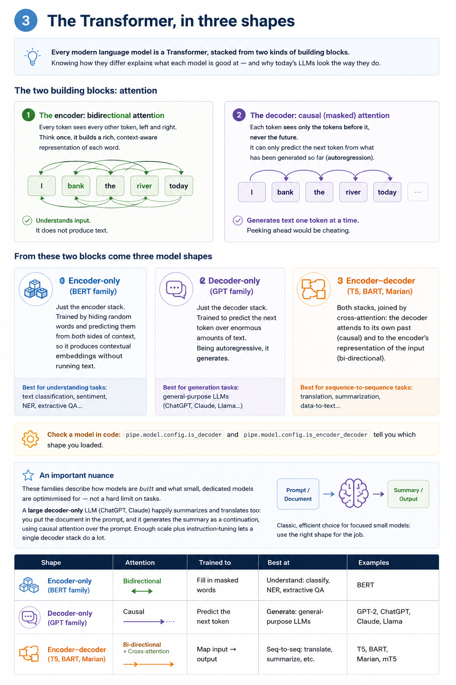

# Introduction to LLMs in Python — Personal Study Guide

> **What this is.** A study companion for your own learning, built from the *skills* in the
> DataCamp course you downloaded. Each section **explains the theory**, then gives you
> **original exercises**: for each one you get the task, a walk-through of the code you're
> handed, a hint, and the file to complete. **Solutions are in a separate document**
> (`study-guide-solutions.pdf`) — try each exercise first. Personal use only.

The runnable workbook is in [`llm-exercises/`](llm-exercises/): **one self-contained file per
exercise** under `exercises/` (imports at the top, `solve` to complete), answers under
`solutions/`, and `check.py` (verifier).

---

## 1 · Setup & how to verify it works

```bash
cd llm-exercises
python3 -m venv .venv && source .venv/bin/activate      # Windows: .venv\Scripts\activate
pip install -r requirements.txt
```

**Confirm your environment before starting** (exercises 4 and 9 need no internet):

```bash
python check.py 4 9                 # expect two TODO lines — harness runs, work not done
python check.py --solutions 4 9     # expect: PASS  PASS  — reference solutions run
```

Then work through `exercises/` and re-run the verifier:

```bash
python check.py                     # checks all 11
python check.py 1 2 6               # only some
python check.py --show 4 11         # also PRINT what each solve() returned
python exercises/ex01_summarize.py  # or run a single file standalone (prints its output)
```

Tip: `check.py` shows only PASS/FAIL by default. Add **`--show`** to also print each
`solve()`'s return value, or run a file directly (`python solutions/ex01_summarize.py`) to
see its output.

Each exercise reports one status:

| Status | Meaning |
|---|---|
| **PASS** | Your `solve()` returned the right thing. |
| **TODO** | Not implemented yet (an `____` blank is still there). |
| **FAIL** | It ran but returned something wrong (the message says why). |
| **SKIP** | A model/dataset couldn't download (no internet), or deps missing. |
| **ERR**  | Unexpected error (message shown). |

Exercises other than 4 and 9 download a **small** model from the Hugging Face Hub on first
use (internet + a few hundred MB). Everything runs on CPU except real training.

To complete an exercise, open its file, replace each `____` blank (the comment above each line
says what goes there), and re-run the verifier.

For a text exercise the verifier runs the file's own `SAMPLE`, so editing `SAMPLE` changes what
you see (and `--show` prints *your* input's result); `PASS` means the result is **valid** — a
real POSITIVE/NEGATIVE label, a non-empty translation, and so on — not that some fixed sentence
matched.


---

## 2 · Using pre-trained models with pipelines

A **large language model (LLM)** is a deep-learning model — almost always a
**Transformer** — with a huge number of parameters, trained on massive amounts of text.
You rarely build one; you *use* one that already exists. Hugging Face's `transformers`
library makes that a one-liner through the **`pipeline()`** function: you name a *task* and
(optionally) a *model*, and it hands back a callable that does the whole job — tokenizing the
input, running the model, and decoding the output.

Tasks fall into two broad families. **Understanding** tasks read text and return a structured
result — a label or a span: sentiment analysis, classification, extractive question-answering.
**Generation** tasks produce new text: text generation, summarization, translation.

For generation you usually set a few knobs. `max_length` caps how long the output can be;
`truncation=True` trims over-long inputs; and `pad_token_id` tells the model which token to
pad with — setting it to `tokenizer.eos_token_id` (the end-of-sequence token) silences the
common padding warning. Beyond parameters, the strongest lever is the **prompt** itself: the
words you feed in steer what comes out. **Translation** is just another task — either name it
explicitly (`translation_en_to_es`) or pick a dedicated model such as the
`Helsinki-NLP/opus-mt-*` family.

### Exercises

#### Exercise 1 · Summarize with a pipeline

**Task.** Return a ≤ 40-word summary of `text` using a `summarization` pipeline.

**What the code does.** The file imports `pipeline`, the one-line entry point to a pretrained model. `pipeline(task=…, model=…)` builds a ready-to-use summarizer around the DistilBART model; calling `summarizer(text, max_length=40)` runs it and returns a **list with one dict**, where `max_length=40` caps the summary length. The two blanks are the **task string** that tells `pipeline` which job to do, and the **dict key** that holds the produced summary.

**Line by line:**

- `from transformers import pipeline` — imports `pipeline`, the one-line helper that wraps a pretrained model into a ready-to-call object.
- `def solve(text):` — defines the function; `text` is the long passage you want to summarize.
- `summarizer = pipeline(task=____, model="sshleifer/distilbart-cnn-12-6")` — builds a **summarization** pipeline around the DistilBART model — this downloads the model from the Hugging Face Hub the first time. The blank is the *task name*.
- `out = summarizer(text, max_length=40)` — runs the model on `text`; `max_length=40` caps the summary length. It returns a **list with a single dict**, e.g. `[{"summary_text": "…"}]`.
- `return out[0][____]` — takes the first (only) element and reads the summary string out of its dict. The blank is the *key* that holds it.

**Why this model.** Summarization is a *sequence-to-sequence* task — read a whole document, then write a shorter one — so it needs an **encoder-decoder** Transformer (see §3). `sshleifer/distilbart-cnn-12-6` is a **distilled BART** (a smaller, faster BART) fine-tuned on the CNN/DailyMail *news* dataset; the `12-6` are its 12 encoder and 6 decoder layers. That fine-tuning is exactly why it condenses text into fluent, news-style summaries out of the box — a plain GPT-style model would just keep writing, not summarize.

**Hint.** The task is named after what it does. The result is a one-element list of dicts, and the field name tells you which one holds the summary.

Complete this in `exercises/ex01_summarize.py`:

```python
from transformers import pipeline


def solve(text):
    # Fill: the task name for summarization, and the output key.
    summarizer = pipeline(task=____, model="sshleifer/distilbart-cnn-12-6")
    out = summarizer(text, max_length=40)
    return out[0][____]
```

#### Exercise 2 · Generate text (control length + padding)

**Task.** Return ~30 **new** tokens of continuation from `distilgpt2`, with **no** warnings.

**What the code does.** `pipeline("text-generation", "distilgpt2")` wraps distilGPT-2; calling `gen(prompt, …)` continues your prompt, and `truncation=True` trims an over-long prompt. The two blanks are `max_new_tokens` (how many **new** tokens to generate — the modern length control; `max_length` is the older one that counts the prompt too, and mixing both triggers a warning) and `pad_token_id` (which token id the model pads with — GPT-2 has no dedicated pad token, so you reuse the tokenizer's end-of-sequence token).

**Line by line:**

- `from transformers import pipeline` — imports `pipeline`, the one-line helper that wraps a pretrained model.
- `def solve(prompt):` — defines the function; `prompt` is the starting text the model will continue.
- `gen = pipeline(task="text-generation", model="distilgpt2")` — builds a **text-generation** pipeline around distilGPT-2 — downloaded from the Hub the first time.
- `out = gen(prompt, max_new_tokens=____, pad_token_id=gen.tokenizer.____, truncation=True)` — runs the model on `prompt`. `max_new_tokens` (blank) caps how many **new** tokens are generated — use this rather than `max_length` (the pipeline defaults `max_new_tokens`, so setting `max_length` too would warn). `pad_token_id` (blank) sets which token pads short outputs — GPT-2 has no pad token, so you reuse its end-of-sequence token, exposed on `gen.tokenizer`; `truncation=True` trims an over-long prompt. Returns a **list with one dict**.
- `return out[0]["generated_text"]` — reads the generated string (prompt + continuation) from the first result's dict, under the `generated_text` key.

**Why this model.** Text generation means predicting the next token over and over — which is what a **decoder-only** Transformer does (see §3). `distilgpt2` is a **distilled GPT-2** (~82M parameters, a lighter/faster GPT-2) small enough to download and run on a CPU. It is *not* fine-tuned for any task, so it simply **continues** whatever text you give it — which is precisely what lets you see raw next-token generation.

**Hint.** The task says how many *new* tokens. For padding, remember GPT-2 has no pad token, so it reuses its *end-of-sequence* token — look for that id on the tokenizer.

Complete this in `exercises/ex02_generate.py`:

```python
from transformers import pipeline


def solve(prompt):
    gen = pipeline(task="text-generation", model="distilgpt2")
    # Fill: how many NEW tokens to generate (30), and the end-of-sequence token id
    # to pad with. (Use max_new_tokens, not max_length: the pipeline already
    # defaults max_new_tokens, so mixing in max_length triggers a warning.)
    out = gen(prompt, max_new_tokens=____,
              pad_token_id=gen.tokenizer.____, truncation=True)
    return out[0]["generated_text"]
```

#### Exercise 3 · Translate with a pipeline

**Task.** Return the English→Spanish translation of `text`.

**What the code does.** `pipeline(task=…, model="Helsinki-NLP/opus-mt-en-es")` builds a Marian EN→ES translator; calling it returns `[{"translation_text": …}]`, which the code reads. The blank is the **task name**, which for translation encodes the direction.

**Line by line:**

- `from transformers import pipeline` — imports `pipeline`, the one-line helper that wraps a pretrained model.
- `def solve(text):` — defines the function; `text` is the English sentence to translate.
- `translator = pipeline(task=____, model="Helsinki-NLP/opus-mt-en-es")` — builds a **translation** pipeline around the Marian OPUS-MT English→Spanish model — downloaded from the Hub the first time. The blank is the *task name*.
- `return translator(text)[0]["translation_text"]` — runs it; the pipeline returns `[{"translation_text": …}]`, and this reads the translated string from the first (only) dict.

**Why this model.** Translation is a *sequence-to-sequence* task — read a full sentence in one language, then write it in another — so, like summarization, it uses an **encoder-decoder** Transformer (see §3). `Helsinki-NLP/opus-mt-en-es` is a **MarianMT** model from the OPUS project, trained specifically on English→Spanish parallel text; its name encodes exactly that (`opus-mt-en-es` = OPUS machine translation, en→es). Being a small model dedicated to one language pair, it translates accurately and cheaply — a big general LLM could translate too, but this is the focused, efficient choice.

**Hint.** Translation task names encode the direction as `translation_<src>_to_<tgt>`; fill in the two language codes.

Complete this in `exercises/ex03_translate.py`:

```python
from transformers import pipeline


def solve(text):
    # Fill: the task name for English -> Spanish translation.
    translator = pipeline(task=____,
                          model="Helsinki-NLP/opus-mt-en-es")
    return translator(text)[0]["translation_text"]
```


---

## 3 · The Transformer, in three shapes

Every modern language model is a **Transformer**, built from two kinds of block: an
**encoder** (bidirectional attention — each token sees the whole input, so it *understands*) and
a **decoder** (causal attention — each token sees only what came before, which is what lets it
*generate*). Keeping one or both gives three model shapes, each suited to different tasks. The
figure below is the whole picture at a glance.



### Exercises

#### Exercise 4 · Pick the right transformer family  ·  *offline*

**Task.** Map a task key (`"sentiment"`, `"poem"`, `"translation"`, `"extractive-qa"`) to `"encoder-only"` / `"decoder-only"` / `"encoder-decoder"`. *Offline.*

**What the code does.** Pure Python, no model. `solve(task)` looks a task up in a dictionary and returns which Transformer family fits it. The four blanks are the **family strings** for each task.

**Hint.** Sort each task by what it needs: to *understand* the input, to *generate* free text, or to *transform* one sequence into another.

Complete this in `exercises/ex04_family.py`:

```python
def solve(task):
    # Fill each family: understanding -> "encoder-only";
    # free generation -> "decoder-only"; seq-to-seq -> "encoder-decoder".
    families = {
        "sentiment": ____,
        "poem": ____,
        "translation": ____,
        "extractive-qa": ____,
    }
    return families[task]
```

#### Exercise 5 · Classify sentiment

**Task.** Return `"POSITIVE"` / `"NEGATIVE"` for `text` using a fine-tuned sentiment pipeline.

**What the code does.** `pipeline(task=…, model="distilbert-base-uncased-finetuned-sst-2-english")` wraps a DistilBERT model fine-tuned on movie-review sentiment; calling it returns `[{"label": …, "score": …}]`. The blanks are the **task name** and the **key** holding the predicted label.

**Line by line:**

- `from transformers import pipeline` — imports the pipeline helper.
- `def solve(text):` — defines the function; `text` is the sentence to classify.
- `clf = pipeline(task=____, model="distilbert-base-uncased-finetuned-sst-2-english")` — builds a classification pipeline around a DistilBERT model fine-tuned for sentiment (downloaded the first time). The blank is the *task name*.
- `return clf(text)[0][____]` — runs it; the pipeline returns `[{"label": …, "score": …}]`, and this reads the predicted label. The blank is the *key*.

**Why this model.** `distilbert-base-uncased-finetuned-sst-2-english` is an **encoder-only** DistilBERT (§3) that has **already been fine-tuned** on SST-2 (a movie-review sentiment dataset) to output POSITIVE/NEGATIVE. Because the fine-tuning is done, the pipeline classifies out of the box; DistilBERT itself is a distilled (smaller, faster) BERT.

**Hint.** The task name is the common two-word phrase for judging sentiment; the result dict reports its prediction under an obvious key.

Complete this in `exercises/ex05_sentiment.py`:

```python
from transformers import pipeline


def solve(text):
    # Fill: the task name for sentiment, and the output key holding the label.
    clf = pipeline(task=____,
                   model="distilbert-base-uncased-finetuned-sst-2-english")
    return clf(text)[0][____]
```


---

## 4 · From pipelines to Auto classes: datasets & tokenization

`pipeline()` is convenient but hides everything. To fine-tune — or simply to control the
pieces — you drop down to the **Auto classes**: `AutoTokenizer` for the tokenizer and
`AutoModelForSequenceClassification` (or `AutoModel`, …) for the model, each loaded with
`.from_pretrained(name)`.

It helps to picture the **LLM lifecycle**: **pre-training** on broad data teaches general
language patterns; then optional **fine-tuning** on your own domain-specific data adapts the
model to a task. That data usually comes from a dataset — `datasets.load_dataset(...)` — which
you must turn into numbers.

That conversion is **tokenization**. A tokenizer splits text into tokens and maps them to
`input_ids` (plus an `attention_mask`). The knobs you'll use constantly: `padding` (pad short
sequences so a batch is rectangular), `truncation` + `max_length` (cap long ones), and
`return_tensors="pt"` (return PyTorch tensors). Modern tokenizers are **subword**: rare words
split into meaningful pieces, so nothing is ever truly "out of vocabulary". To tokenize a
whole dataset efficiently, wrap the tokenizer in a function and apply it across the whole
dataset, in batches, with `dataset.map(fn, ...)`.

### Exercises

#### Exercise 6 · Load an Auto model + tokenizer

**Task.** Return `(tokenizer, model)`, where the model is an `AutoModelForSequenceClassification` with 2 labels.

**What the code does.** This is the control path (no pipeline). `AutoTokenizer.from_pretrained(name)` downloads the tokenizer that matches the model. The blanks are **which Auto class** loads the model (it must add a classification head) and **how many labels** that head has.

**Line by line:**

- `from transformers import AutoTokenizer, AutoModelForSequenceClassification` — imports the tokenizer and model **Auto classes** — the control path used to fine-tune.
- `def solve():` — no input; it returns the two objects you need.
- `name = "distilbert-base-uncased"` — the base model id — plain DistilBERT, *not* fine-tuned for any task.
- `tokenizer = AutoTokenizer.from_pretrained(name)` — downloads the tokenizer that matches that model.
- `model = ____.from_pretrained(name, num_labels=____)` — loads the model with a fresh classification head. Blanks = which Auto class to use and how many output labels.
- `return tokenizer, model` — hands both back — you need the pair to tokenize *and* to run/fine-tune the model.

**Why this model.** `distilbert-base-uncased` is the **plain**, *not*-fine-tuned DistilBERT (encoder-only). `AutoModelForSequenceClassification` bolts a **fresh, untrained** classification head on top — so its predictions are random until you fine-tune it. That's the whole point: this is the *starting point for training*, in contrast to ex5, which loaded the already-fine-tuned version.

**How it classifies.** DistilBERT turns the text into **contextual embeddings** — one vector per token. The vector of the special `[CLS]` token (the first one) is used as the **summary of the whole sentence**. The **classification head** (a small linear layer — in DistilBERT preceded by a pre-classifier + ReLU) maps that summary vector to one **logit** per class: raw, unbounded scores. To read them as probabilities you apply **softmax**; but to simply pick the predicted class you take the `argmax` of the logits directly — no softmax needed (that's what ex11 does). One caveat specific to this exercise: the head is **freshly added and untrained**, so its logits are essentially random until you fine-tune the model (contrast with ex5, whose head is already trained).

**Hint.** Of the two imported classes, one adds a classification head — its name says so. How many classes does POSITIVE-vs-NEGATIVE have?

Complete this in `exercises/ex06_load_model.py`:

```python
from transformers import AutoTokenizer, AutoModelForSequenceClassification


def solve():
    name = "distilbert-base-uncased"
    tokenizer = AutoTokenizer.from_pretrained(name)
    # Fill: which imported class loads a classification head, and how many labels.
    model = ____.from_pretrained(name, num_labels=____)
    return tokenizer, model
```

#### Exercise 7 · Tokenize texts (padding, truncation, tensors)

**Task.** Return padded, truncated (max 64) PyTorch tensors for a list of `texts`.

**What the code does.** The code calls the tokenizer on a list of texts. `padding=True` pads sequences to equal length so they form a rectangular batch; `truncation=True` cuts overly long ones. The blanks are the **tensor format** to return and the **max length** cap.

**Line by line:**

- `from transformers import AutoTokenizer` — imports the tokenizer class (used by the demo).
- `def solve(tokenizer, texts):` — receives a ready tokenizer and a list of texts.
- `return tokenizer(texts, return_tensors=____, padding=True, truncation=True, max_length=____)` — tokenizes the batch: `padding=True` pads all to equal length (a rectangular batch), `truncation=True` cuts long ones. Blanks = the tensor format and the length cap.

**`input_ids` & `attention_mask`.** The tokenizer returns a small dictionary of tensors:

- **`input_ids`** — the text turned into numbers: each token maps to an integer id from the model's vocabulary. For DistilBERT, `101` and `102` are the special `[CLS]`/`[SEP]` markers that wrap every sentence, and `0` is `[PAD]`.
- **`attention_mask`** — a parallel array, same shape, with **1 = real token** and **0 = padding**. *How it protects the result:* inside the Transformer, attention makes each token look at the others through weights produced by a **softmax**. At every position where the mask is 0, the attention score is set to **−∞ before the softmax**, and since `e^(−∞) = 0` those slots get weight **0** — so padding contributes nothing and real tokens attend only to real tokens. That's why you can pad as much as you like without changing the output.
- **Not the same as the causal mask** (§3): `attention_mask` says *which tokens are real*; the causal mask (decoders only) says *each token may see only earlier ones*. The model adds the causal one itself — the tokenizer gives you the padding one.
- You always pass both to the model together: `model(**enc)` (i.e. `model(input_ids=…, attention_mask=…)`).

**Hint.** PyTorch tensors have a two-letter code; the length cap is the number named in the task.

Complete this in `exercises/ex07_tokenize.py`:

```python
from transformers import AutoTokenizer


def solve(tokenizer, texts):
    # Fill: return PyTorch tensors ("pt"), and cap the length at 64 tokens.
    return tokenizer(texts, return_tensors=____, padding=True,
                     truncation=True, max_length=____)
```

#### Exercise 8 · Tokenize a whole dataset with .map

**Task.** Tokenize a dataset row-by-row with `.map`, processing it in batches.

**What the code does.** `load_dataset("imdb", split="train[:1%]")` loads 1% of the train split; the inner `tok` function tokenizes the `text` column; `.map` applies it to every row. The blank controls whether `.map` passes rows **one at a time or in batches**.

**The point.** The goal of this exercise isn't to train the model — it's to **prepare the data**. The raw dataset held only `text` and its `label`; running it through `.map` with the tokenizer produces a new dataset that keeps those and adds `input_ids` and `attention_mask` — the format Transformers expect for fine-tuning. In effect you've turned a **human-readable** dataset into one a **neural network can process**: `input_ids` and `attention_mask` are the model's **inputs**, `label` is the **target** it must learn to predict, and `text` just rides along. (One technicality: right after `.map` the ids are still Python lists; the Trainer / data collator turns them into tensors at training time.)

**Line by line:**

- `from transformers import AutoTokenizer` — the tokenizer class (used by the demo).
- `from datasets import load_dataset` — the loader for ready-made datasets.
- `def solve(tokenizer):` — receives a tokenizer to apply.
- `data = load_dataset("imdb", split="train[:1%]")` — loads 1% of IMDB's train split — a small set of labelled movie reviews.
- `def tok(batch): ...` — a helper that tokenizes the `text` column of a batch of rows.
- `return data.map(tok, batched=____)` — applies `tok` across the whole dataset. Blank = process rows **in batches** (much faster).

**Batched tokenization with `.map`.** `data.map(tok, …)` applies the tokenizer across the **whole dataset** instead of one sentence at a time, and returns a **new dataset** that keeps the original columns (`text`, `label`) and **adds** `input_ids` and `attention_mask` — the columns the model consumes during fine-tuning. Three details worth knowing:

- **Batch size:** processing *in batches* doesn't mean *all at once* — by default `tok` receives **1,000 rows** per call.
- **Where the speed comes from:** the big win is that **fast (Rust) tokenizers** process a whole batch in parallel; with a slow (pure-Python) tokenizer the gain is much smaller.
- **A padding gotcha:** `padding=True` here pads **within each batch**, so different batches can end up with different lengths. For training you often defer padding to a *data collator* (dynamic per-batch padding) or use `padding="max_length"` for a uniform size.

**Hint.** You want `.map` to process rows in batches rather than one at a time.

Complete this in `exercises/ex08_tokenize_dataset.py`:

```python
from transformers import AutoTokenizer
from datasets import load_dataset


def solve(tokenizer):
    data = load_dataset("imdb", split="train[:1%]")

    def tok(batch):
        return tokenizer(batch["text"], padding=True, truncation=True, max_length=128)

    # Fill: apply tok across the dataset in batches.
    return data.map(tok, batched=____)
```


---

## 5 · Fine-tuning through training

With a model and a tokenized dataset in hand, fine-tuning comes down to three objects.
**`TrainingArguments`** holds the hyperparameters — where to save (`output_dir`), when to
evaluate (`eval_strategy="epoch"`), how long (`num_train_epochs`), how fast
(`learning_rate`), the batch sizes, and regularization (`weight_decay`). **`Trainer`** ties
everything together — the model, those args, the train and eval datasets, and the tokenizer —
and `trainer.train()` runs the loop.

Once trained, using the model directly means doing by hand what the pipeline did for you:
tokenize the text, run it under `torch.no_grad()` (no gradients needed for inference), read the
raw **logits**, take the `argmax` for the predicted class id, and map that id to a label via
`model.config.id2label`. Finally, `model.save_pretrained(dir)` and
`tokenizer.save_pretrained(dir)` persist your work; `from_pretrained(dir)` loads it back.

> **Heads-up:** in recent `transformers`, `TrainingArguments` and `Trainer` need the
> **`accelerate`** package (it's in `requirements.txt`). If you see *"the Trainer ... requires
> accelerate"*, run `pip install -r requirements.txt` (or `pip install "accelerate>=1.1.0"`).

### Exercises

#### Exercise 9 · Set up TrainingArguments  ·  *offline*

**Task.** Return `TrainingArguments`: output `./out`, evaluate each epoch, 3 epochs, lr 2e-5, train/eval batch 8, weight decay 0.01. *Offline.*

**What the code does.** This constructs the hyperparameter bundle for training. `output_dir` is where checkpoints go; each blank is one hyperparameter — when to evaluate, how many epochs, the learning rate, the train batch size, and weight decay — with its **target value written in the comment beside it**.

**The point.** This exercise doesn't train anything — it **defines the rules of training**. `TrainingArguments` is a configuration object the `Trainer` reads later to know how many passes to make over the data (**epochs**), how big each weight update is (**learning rate**), how many examples to process at once (**batch size**), how much to regularise (**weight decay**), when to **evaluate**, and where to **save checkpoints** (`output_dir`). It's the *flight plan* the fine-tuning run will follow — it has dozens of options, and here you set the essential ones.

**Line by line:**

- `from transformers import TrainingArguments` — imports the hyperparameter container.
- `def solve():` — returns the configuration object (no training happens here).
- `return TrainingArguments(output_dir="./out", eval_strategy=____, num_train_epochs=____, …)` — builds the training config; `output_dir` is where checkpoints go and each blank is one hyperparameter (eval schedule, epochs, learning rate, train batch size, weight decay) — the target value is written in the comment beside each blank.

**Key hyperparameters.** Three settings are worth understanding, not just filling in:

- **`num_train_epochs` (epochs)** — one epoch is one full pass over the whole training set, so `3` means the model sees every example three times. Too few and it *underfits* (hasn't learned enough); too many and it starts to *memorise* the training data (**overfits**).
- **`learning_rate`** — the **size of each step** when the weights are updated. Big steps learn fast but can overshoot and diverge; tiny steps are stable but slow. `2e-5` (0.00002) is a deliberately small value typical of fine-tuning: the pretrained weights are already good, so you only want to *nudge* them, not overwrite them.
- **`weight_decay`** — a **regularisation** term that, each step, gently pulls every weight toward zero (it penalises large weights). The penalty grows with the **square** of each weight (L2), so a few big weights cost far more than many small ones — e.g. two weights of 1 cost `1+1 = 2`, but one weight of 2 costs `2×2 = 4`. The model therefore prefers to **spread** the signal across many features rather than lean hard on one, which **reduces overfitting**. It's a lever, though: too strong and the model is over-constrained and *underfits*. `0.01` is a mild, standard value. (Technical note: this is L2 regularisation; the `Trainer`'s AdamW optimiser applies it as *decoupled* weight decay — directly on the weights — but the intuition is the same.)

**Hint.** Each value you need is written in the comment next to its blank.

Complete this in `exercises/ex09_training_args.py`:

```python
from transformers import TrainingArguments


def solve():
    # Fill the values described in the task.
    return TrainingArguments(
        output_dir="./out",
        eval_strategy=____,               # evaluate at the end of each epoch
        num_train_epochs=____,            # 3
        learning_rate=____,               # 2e-5
        per_device_train_batch_size=____, # 8
        per_device_eval_batch_size=8,
        weight_decay=____,                # 0.01
    )
```

#### Exercise 10 · Wire up the Trainer

**Task.** Return a `Trainer` built from the pieces (don't call `.train()`).

**What the code does.** In a single call you build the `Trainer` — the object that will run the fine-tuning loop — handing it the pieces from the previous exercises. `solve()` only *constructs* it; no training happens here.

**The point.** This is the moment **every piece you built connects into one pipeline**. There's no need to wire the arguments one by one to learn them — `model` (ex6), `TrainingArguments` (ex9), the train/eval datasets (ex8) and the `tokenizer` (ex6/7) were each covered already. The new idea is that the **`Trainer` orchestrates the whole fine-tuning**: hand it those pieces and it knows how to run the training loop.

**Is the model being trained in this exercise? It depends what you run:**

- **`solve()`** — the part you complete — only **builds** the `Trainer` object. **No training.**
- **Running the file** (`python exercises/ex10_build_trainer.py`) builds it *and* then calls `trainer.train()` on a tiny dataset for two steps — **yes, a real mini-train** you can watch (a loss is printed).
- **`python check.py 10`** only verifies the wiring. **No training.**

So the *exercise itself* just assembles the Trainer; the bundled *demo* adds a two-step train so the loop isn't abstract. And what `trainer.train()` actually does, each step, is: pull a **batch** from the `train_dataset` → run it **through the model** → compute the **loss** (how wrong it is) → **backpropagate** to get the gradients (which way each weight should move) → **update the weights** a little (step size = the learning rate) → **evaluate** when `eval_strategy` says to → **save checkpoints** to `output_dir`.

**Hint.** Each `Trainer` parameter takes the argument of the same name that `solve` received.

Complete this in `exercises/ex10_build_trainer.py`:

```python
from transformers import (AutoTokenizer, AutoModelForSequenceClassification,
                          Trainer, TrainingArguments)
from datasets import Dataset


def solve(model, args, train_ds, eval_ds, tokenizer):
    # Fill: pass the model, the args, and the two datasets into the Trainer.
    return Trainer(
        model=____,
        args=____,
        train_dataset=____,
        eval_dataset=____,
        tokenizer=tokenizer,
    )
```

#### Exercise 11 · Use the fine-tuned model (from logits)

**Task.** Return `"POSITIVE"`/`"NEGATIVE"` for `text`, computed **from raw logits**.

**The key idea.** The goal isn't to learn `torch.argmax()` — it's to understand that a
classification model **doesn't return a label**; it returns **logits** (raw numeric scores), and
*you* have to turn those into the final class. This exercise does by hand what `pipeline()` was
doing for you automatically.

**Where we are.** This is the last step of *inference*:

```
Text  ->  Tokenizer  ->  Model  ->  Logits  ->  pick the best class  ->  "POSITIVE"
```

**What are logits?** The model doesn't hand back `POSITIVE`; it returns a vector of scores, e.g.

```
tensor([[-1.25, 3.82]])
```

one score per class (index `0` -> NEGATIVE, index `1` -> POSITIVE). These are **not** probabilities
— they're raw scores. (You'd apply *softmax* to turn them into probabilities, but you don't need
to just to pick the winner.)

**How we get the prediction.** `torch.argmax(logits, dim=1)` returns the *position* of the
largest value. For `[-1.25, 3.82]` that is `1`, because `3.82` is the highest.

**Why `dim=1`?** Logits have shape `[batch, classes]` — one row per sentence, one column per
class. Reducing over `dim=1` (the class axis) picks the top class **for each sentence** in the
batch.

**How we get the label.** The model carries a dictionary `model.config.id2label`, e.g.
`{0: "NEGATIVE", 1: "POSITIVE"}`, so `model.config.id2label[pred]` turns the class id into a
human-readable label.

**Why `torch.no_grad()`?** At inference we don't want to compute gradients or update weights — we
only read a prediction. Wrapping the forward pass in `with torch.no_grad():` makes it faster and
use less memory.

**Why the model matters.** This is the same SST-2 fine-tuned DistilBERT as ex5. *Because* it's
fine-tuned, its logits are meaningful and `argmax` gives a real POSITIVE/NEGATIVE; the untrained
head from ex6 would give noise.

**The full flow:**

```
Text
  |
  v
Tokenizer  ->  input_ids
  |
  v
fine-tuned Model
  |
  v
Logits            e.g. [-1.25, 3.82]
  |
  v   argmax()  ->  1
id2label[1]
  |
  v
"POSITIVE"
```

**What you really learn.** This exercise reveals what was hidden inside `pipeline()`: a
classification model returns a vector of **logits**, and making a prediction means selecting the
highest-scoring class (`argmax`) and mapping its id to a label (`id2label`). That is what actually
happens during inference with a Transformer.

**Hint.** Logits are shaped `[batch, classes]`, so reduce over the class axis; then match the capitalisation the task expects.

Complete this in `exercises/ex11_predict.py`:

```python
import torch
from transformers import AutoTokenizer, AutoModelForSequenceClassification


def solve(text):
    name = "distilbert-base-uncased-finetuned-sst-2-english"
    tok = AutoTokenizer.from_pretrained(name)
    model = AutoModelForSequenceClassification.from_pretrained(name)
    inp = tok(text, return_tensors="pt", padding=True, truncation=True)
    with torch.no_grad():
        logits = model(**inp).logits
    # Fill: the axis to argmax over (1), and the string method to upper-case.
    pred = int(torch.argmax(logits, dim=____))
    return model.config.id2label[pred].____()
```


---

## 6 · Fine-tuning approaches & N-shot prompting

Full training isn't the only option. **Full fine-tuning** updates every weight — most
powerful, most expensive. **Partial fine-tuning** freezes most layers and trains only a few —
cheaper and less prone to overfitting. **Transfer learning** is the umbrella idea: take a
model trained on one task and adapt it to a related one.

Often you don't need to train at all. **N-shot prompting** teaches the model *inside the
prompt*, by example: **zero-shot** gives no example (just the instruction), **one-shot** gives
a single worked example, and **few-shot** gives several. More examples generally sharpen the
output format and accuracy — at the cost of a longer prompt.


---

## 7 · Where to look things up

**Start here (official, free):**

- **Hugging Face LLM/NLP Course** — the best structured, hands-on intro: <https://huggingface.co/learn>
- **Transformers docs (home)** — <https://huggingface.co/docs/transformers>

**API reference for what you used in these exercises:**

- `pipeline()` and the full task list — <https://huggingface.co/docs/transformers/main_classes/pipelines>
- **Auto classes** (`AutoTokenizer`, `AutoModelFor…`) — <https://huggingface.co/docs/transformers/model_doc/auto>
- **Tokenizer** (padding / truncation / `return_tensors`) — <https://huggingface.co/docs/transformers/main_classes/tokenizer>
- **Trainer & TrainingArguments** — <https://huggingface.co/docs/transformers/main_classes/trainer>
- **Datasets** (`load_dataset`, `.map`) — <https://huggingface.co/docs/datasets>
- **Task guides** (summarization, translation, classification, QA…) — <https://huggingface.co/docs/transformers/tasks/summarization>

**Finding a model:**

- **The Model Hub** — filter by task on the left: <https://huggingface.co/models>
- **Read the model card** — what architecture it is, its intended task and languages, and the
  exact `model=` id to copy.

**Background / the "why":**

- PyTorch docs — <https://pytorch.org/docs/stable/index.html>
- Papers: *Attention Is All You Need* (Transformer, 2017), *BERT* (2018), *GPT-2* (2019) —
  searchable on <https://arxiv.org>

**A skill worth practising, not just bookmarking:**

- In Python, `help(pipeline)` (or `TrainingArguments?` in a notebook) prints the docstring for
  any object — the fastest reference of all.
- Every argument you pass (`max_length`, `eval_strategy`, …) has a one-line explanation in the
  class's docstring / API page — look it up there instead of guessing.


---

## 8 · Self-check

You can now: run a task with `pipeline()`; control generation length/padding; translate;
tell encoder-only / decoder-only / encoder-decoder apart and verify in code; move from
`pipeline` to Auto classes; tokenize (with padding/truncation) and `.map` a dataset; set up
`TrainingArguments` + `Trainer`; run inference from logits; and prompt zero/one/few-shot.
That's the whole arc of the two chapters.
